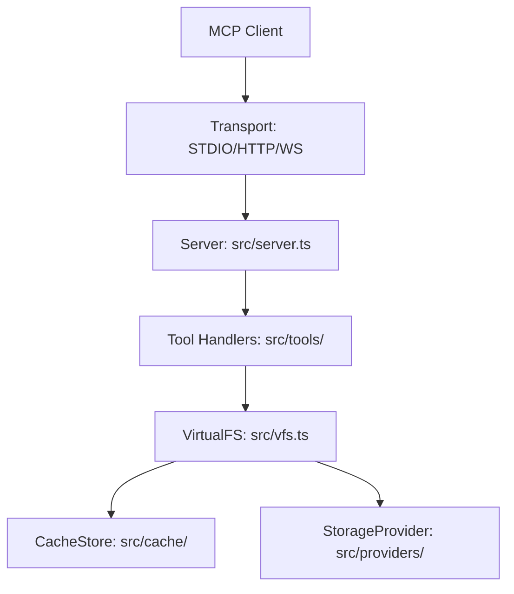

# Gemini CLI Mandate: mcp-server-cloud-fs

This repository contains `@nogoo9/mcp-server-cloud-fs`, a high-performance MCP server and programmatic library that provides a cloud-native replacement for `mcp-server-filesystem`. It supports AWS S3, Azure Blob Storage, Google Cloud Storage, and SQLite backends while maintaining strict compatibility with the standard filesystem tool API.

## Project Overview

- **Purpose:** Expose cloud object storage as a virtual filesystem to MCP clients (Claude Desktop, Claude Code, etc.).
- **Architecture:** 
  - **Tool Layer:** Implements standard and extended tools (read, write, search, shell).
  - **VirtualFS (VFS):** A FUSE-inspired write-back overlay that handles cache coherence, inode management, and directory indexing.
  - **Cache Layer:** Pluggable backends (Memory, Filesystem, Redis) for metadata and content caching.
  - **Provider Layer:** Pluggable storage adapters (S3, Azure, GCS, SQLite, Memory).
  - **Transport Layer:** Supports STDIO (local), Streamable HTTP (remote), and WebSocket (Bun-native).
- **Technology Stack:** Bun, TypeScript, Biome (linting/formatting), Docker (infra emulators), Vite (shell app).

## Architecture Map



## Development Conventions

- **Toolchain:** Use **Bun** for all tasks (install, build, test, run).
- **Linting & Formatting:** Strictly adhere to **Biome**. Run `bun run check` to auto-fix and format. Do NOT use ESLint or Prettier.
- **Testing (Mandatory):**
  - **TDD:** Write unit tests before implementing features or fixes.
  - **Unit Tests:** Located in `src/**/*.test.ts`. Use mock providers.
  - **Integration Tests:** Located in `src/providers/*.integration.test.ts`. Run with `bun run test:integration` (requires `bun run infra:up`).
  - **E2E Tests (HTTP):** `src/transports/http.e2e.test.ts`. No infrastructure needed — uses in-memory provider. Run with `bun run test:e2e:http`.
  - **E2E Tests (Infra):** `src/server.e2e.test.ts`. Requires Docker (MinIO + Redis). Run with `bun run test:e2e:infra`.
  - **All E2E:** `bun run test:e2e` runs both HTTP and infra E2E suites.
- **Path Security:** Every path must be validated via `src/path-utils.ts` against configured roots. Unauthorized access must return: `"Access denied: path is outside allowed roots"`.
- **VFS Finalization:** Always ensure `vfs.flush()` is called on process exit to prevent data loss (handled in `src/index.ts`).
- **Error Handling:** Use standard MCP error codes and clear descriptive messages.

## Key Development Commands

| Command | Description |
|---|---|
| `bun install` | Install dependencies |
| `bun run build` | Build the project to `dist/` |
| `bun run typecheck` | Run TypeScript compiler in no-emit mode |
| `bun run check` | Lint, format, and auto-fix with Biome |
| `bun test` | Run unit tests (cache, providers, tools, auth, middleware, VFS) |
| `bun run test:e2e:http` | Run HTTP E2E tests (no infra needed) |
| `bun run test:e2e:infra` | Run infra E2E tests (requires Docker: MinIO, Redis) |
| `bun run test:e2e` | Run all E2E tests (HTTP + infra) |
| `bun run test:integration` | Run provider integration tests against emulators |
| `bun run test:all` | Run every test file across all tiers |
| `bun run infra:up` | Start provider emulators (S3/Azure/GCS/Redis) |
| `bun run infra:down` | Stop provider emulators |
| `bun run build:app` | Build the xterm.js shell app |
| `bun run inspect:memory` | Debug the server with MCP Inspector (In-memory) |

## Key Files & Directories

- `src/index.ts`: CLI entry point, arg parsing, and transport initialization.
- `src/vfs.ts`: Core Virtual Filesystem logic (Inodes, DirIndex, Tombstones).
- `src/server.ts`: MCP server setup and tool registration.
- `src/providers/`: Storage provider implementations (S3, Azure, GCS, etc.).
- `src/cache/`: Cache store implementations (Memory, FS, Redis).
- `src/tools/`: Tool handler logic grouped by functionality.
- `src/tools/shell/`: POSIX-like shell implementation (parser, commands).
- `src/transports/`: Transport implementations (STDIO, HTTP, WebSocket).
- `src/auth/`: OAuth scope definitions, JWT/JWKS token verification.
- `src/middleware/`: Rate limiting, CORS, request logging.
- `src/app/`: Source for the interactive shell MCP app (xterm.js).
- `infra/docker-compose.yml`: Local emulators for integration testing.
- `CLAUDE.md`: Implementation-specific guidance for AI agents.

## Release Process

When preparing a release:
1. Bump `version` in **both** `package.json` and `server.json`.
2. Run `bun run build`.
3. CICD: Publish to npm: `npm publish`.
4. CICD: Update the MCP registry: `npx mcp-publisher publish`.

## AI Agents' Rules & Workflows

Slash-command workflows and always-on rules live in `.agents/`. **Always use them — never bypass.**

### Workflows

| Slash command | File | When to use |
|---|---|---|
| `/format` | `.agents/workflows/format.md` | After **any** code change — `bun run format` + `bun run typecheck` |
| `/commit` | `.agents/workflows/commit.md` | When committing — format → typecheck → safety review → generated commit message → `git add -A && git commit` |
| `/bump` | `.agents/workflows/bump.md` | Version bump — reads commits since last tag, picks semver level, updates `package.json`, `server.json`, CHANGELOG, docs |
| `/test-local` | `.agents/workflows/test-local.md` | Full local gate (no Docker) — format, typecheck, unit tests, HTTP E2E, docs build |
| `/test-e2e` | `.agents/workflows/test-e2e.md` | Full E2E with Docker — HTTP E2E → `infra:up` → health checks → infra E2E → teardown |
| `/security` | `.agents/workflows/security.md` | SAST scan via Semgrep on changed files — mandatory before every push |
| `/docs` | `.agents/workflows/docs.md` | Sync VitePress docs — audits every page against source, regenerates stale diagrams, verifies `docs:build` |
| `/setup-skills` | `.agents/workflows/setup-skills.md` | Install required AI agent skills after cloning (skills are gitignored) |
| `/setup-env` | `.agents/workflows/setup-env.md` | Full environment check — verifies Bun, Node, Docker, Semgrep CLI, Git, installs deps, runs smoke tests, then sets up skills |

### Rules

| Rule | Trigger | Effect |
|---|---|---|
| `.agents/rules/format.md` | `always_on` | Run `/format` after every code change. Task is not done until both `bun run format` and `bun run typecheck` pass with zero errors. |
| `.agents/rules/pre-push.md` | `always_on` | Before `git push`: run `/test-local` (format → typecheck → unit tests → HTTP E2E → `/security` → docs build). All six must pass. Never force-push `main`. |
| `.agents/rules/code-design.md` | `always_on` | Think before coding, simplicity first, surgical changes, goal-driven execution. |
| `.agents/rules/commit.md` | `model_decision` | When user asks to commit/stage, run `/commit` workflow. Never use `git commit --no-verify`. |
| `.agents/rules/docs.md` | `model_decision` | After a feature is committed, run `/docs` to update affected pages, README, CHANGELOG, and diagrams. |

## Documentation Diagrams

Documentation images in `docs/public/images/` are AI-generated diagrams. Every image in the docs markdown must have a **hidden prompt comment** (`@image-prompt`) directly above it so that future LLMs can regenerate the diagram if the architecture changes.

**Convention:**

```markdown
<!-- @image-prompt <filename>.png: <full generation prompt describing the diagram> -->

```

**Rules:**

- When updating a diagram, **always update the `@image-prompt` comment** to match the new content.
- When adding a new diagram, always include the prompt comment above it.
- Prompts should be detailed enough for accurate diagram regeneration.
- All diagrams use a consistent dark navy background (`#1a1a2e`) with modern flat design and white text.
